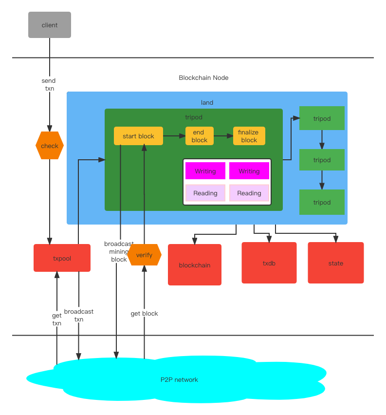

# 基本原理

### 系统架构

### 流程总览
  

从客户端发起一个交易到链上， 会先经过 `txpool` 的检查， 当检查通过后才会被放入交易池当中 并且 广播给其他区块链节点。  
从 P2P 网络里接收到来自其他节点广播的交易，检查通过后放入 `txpool` 中（不再广播） 

`land`运行，开始生成区块，并且对区块进行一系列的处理：包括挖矿出块、广播、验证来自其他节点的区块、执行区块内交易、将区块存入链 等等。 在这个过程中
可以自由控制的事情有非常多,你可以通过它实现你想要的任何共识算法、分片方式、出块时间、打包交易方式、选择何时执行交易 等等。 与`blockchain`， 
`yudb`, `state`的交互也在这个过程中。

每个区块经过 `land` 内所有 自定义`tripod`的逻辑之后， 会进入下一个区块阶段，生成下一个区块并处理，周而复始下去。

