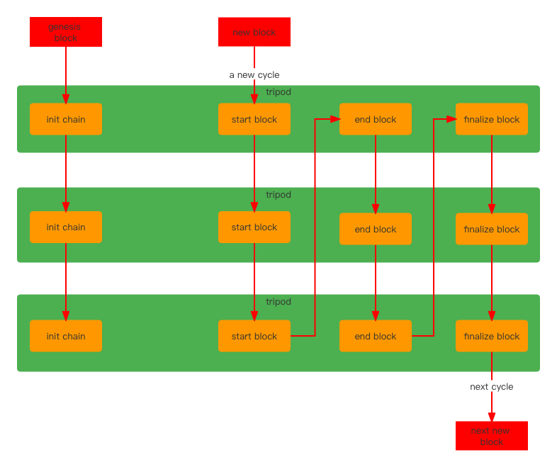

# 鼎  

## tripod  
#### 概述
`tripod`是整个yu框架的核心所在，开发者通过实现它的interface来定义自己的业务逻辑。 它由三部分构成：  
1.  自定义区块验证规则和交易检查逻辑   
2.  控制区块的生命周期从而实现深度定制化开发。生命周期有四个阶段：`initChain`, `startBlock`, `endBlock`, `finalizeBlock`。 其中只有`initChain`
是只有在创世区块的时候才被调用的，后面三个是每次区块都会被调用。 （个性化共识算法便可以用区块生命周期来实现）   
3. 自定义 `交易`(Execution) 和 `查询`(Query) 
#### 接口  
代码定义在[这里](https://github.com/yu-org/yu/blob/master/core/tripod/tripod.go)  

```go
func GetTripodMeta() *TripodMeta
func Name() string
func SetChainEnv(env *ChainEnv)
```
`GetTripodMeta()`返回一个`tripod`的元数据，该元数据定义在[这里。](https://github.com/yu-org/yu/blob/master/core/tripod/tripod_meta.go)
该元数据中囊括了 `Execution` 和 `Query`列表。  
`Name()`返回`tripod`的名称。  
`SetChainEnv(*ChainEnv)`将`ChainEnv`装填进`tripod`中，方便后续调用。(`ChainEnv`介绍在[context与chainEnv](5.2context与chainEnv.md))

## 
```go
func CheckTxn(*SignedTxn) error
func VerifyBlock(block *CompactBlock) bool
``` 
`checkTxn()`是开发者自定义的交易检查逻辑，前面的章节提到过当外部有交易进来插入`txpool`的时候，会执行`BaseChack` 和 `TripodsCheck` 这两步检查，
而`TripodsCheck`便是在这里定义，每个`tripod`都可以定义自己的交易检查逻辑。  
`VerifyBlock()`是开发者自定义的区块校验逻辑，区块链每收到一个外部广播来的区块都需要校验过后才能进行后续处理，不同的链有对区块不同的校验方式，所以 
开发者可以自己定制校验逻辑。 每个`tripod`都可以定义自己的交易检查逻辑。

##  
```go
func InitChain() error
func StartBlock(block *CompactBlock) (needBroadcast bool, err error)
func EndBlock(block *CompactBlock) error
func FinalizeBlock(block *CompactBlock) error
```  
`InitChain()`只会在区块链启动的时候被调用一次，专门用来定义处理`创世区块`。  
`StartBlock()`定义区块生成时的阶段的逻辑，并且需要返回一个类型为`bool`的`needBroadcast`返回值   告诉框架是否需要广播区块。一般如果是本地挖到的区块，是需要广播出去的，如果是从其他节点
获取到的区块，则没必要广播。    
`EndBlock()`定义区块结束时候的逻辑，一般会在这里执行交易并且将区块存入区块链中。   
`FinalizeBlock()`定义区块的`敲定阶段`（即最终共识）的逻辑。如果区块链是`finalize类型的链`，则需要定制这部分逻辑，否则便不必要。


## land  
`land`用来装载所有的`tripod` 供框架调用。
#### `land`内部流程图


 